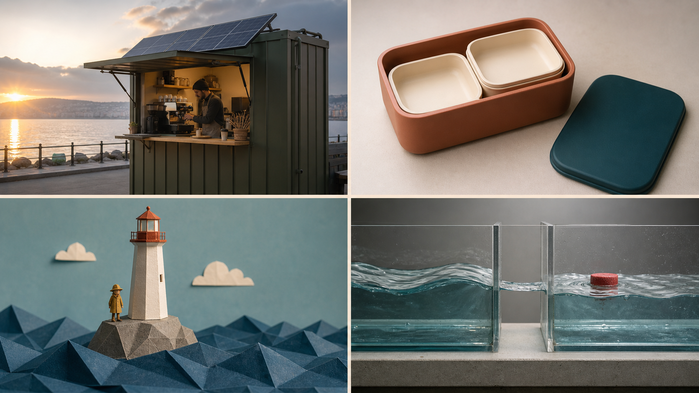

# Awesome MiniMax H3 Video Prompts

> Biblioteca práctica de prompts para MiniMax H3: publicidad, comercio electrónico, UGC, viajes, gastronomía, moda, narrativa, animación, deportes, VFX, interfaces y video corto.

**Idiomas:** [English](./README.md) · [简体中文](./README_zh.md) · [日本語](./README_ja.md) · [한국어](./README_ko.md) · [Español](./README_es.md) · [Français](./README_fr.md) · [Deutsch](./README_de.md) · [Português](./README_pt.md)

## Qué incluye

- 100 prompts audiovisuales en inglés, distribuidos en 21 categorías de producción;
- Estructuras pensadas para referencias de imagen, video y audio en H3;
- Reglas de continuidad para identidad, producto, vestuario, escenario y dirección de pantalla;
- Plantillas para anuncios, producto, UI, animación y formatos sociales;
- Páginas de presentación README en ocho idiomas;
- Una [guía de despliegue](./docs/deployment-guide.md) con una versión completa en chino, una referencia en inglés y resúmenes rápidos en otros siete idiomas: nueve idiomas en total;
- Una [guía de prompts multilingües](./docs/multilingual-prompting.md) con ocho ejemplos en idiomas distintos del inglés y explicaciones en inglés, no traducciones completas de los prompts a nueve idiomas.

Este README en español es una puerta de entrada, no una traducción íntegra de la biblioteca. Los 100 prompts se mantienen en inglés.

→ **[Explorar los 100 prompts](./prompts/README.md)**

[Descripción de H3](./docs/minimax-h3-overview.md) · [Despliegue](./docs/deployment-guide.md) · [Videos oficiales](./docs/official-h3-examples.md) · [Plantillas](./templates/README.md) · [Guía de prompting](./docs/prompting-guide.md) · [Matriz de casos](./docs/use-case-matrix.md) · [Contribuir](./CONTRIBUTING.md)

## Uso con bestimage.ai

- **Generar videos:** Consulta la [página de la API de MiniMax H3 en bestimage.ai (en inglés)](https://bestimage.ai/models/minimax/minimax-h3-text-to-video/) para acceder a la generación de video.
- **Preparar imágenes de referencia y fotogramas iniciales:** Consulta la [página de la API de GPT Image 2 en bestimage.ai (en inglés)](https://bestimage.ai/models/openai/gpt-image-2/). GPT Image 2 genera imágenes, no los videos de H3.
- La [guía del flujo de trabajo con las API](./docs/api-workflow.md) explica cómo combinar ambas etapas. Consulta las páginas de los modelos para obtener los datos vigentes de conexión y de las solicitudes.

## Contribuciones y estado de las pruebas

**Contribuciones abiertas:** Sigue la [guía local de contribución](./CONTRIBUTING.md) para proponer un prompt H3 original que resuelva un problema de producción. El video final es opcional; indica las funciones de las referencias, la cronología, la continuidad, el sonido y el estado de las pruebas.

Los 100 prompts de esta edición son puntos de partida para experimentar, no una demostración de resultados garantizados. Las nueve imágenes nuevas —una portada y ocho ejemplos— se crearon con la herramienta integrada de generación de imágenes. Son conceptos visuales estáticos, no resultados de H3 ni fotogramas de videos probados con H3.

Este repositorio es un proyecto comunitario independiente y no es un proyecto oficial de MiniMax. Verifica especificaciones y entradas en la [documentación oficial de H3](https://platform.minimaxi.com/docs/guides/video-prompt).

## Acerca de bestimage.ai

El equipo de [bestimage.ai](https://bestimage.ai/) selecciona y mantiene esta biblioteca de prompts, que conecta flujos de trabajo creativos con API de modelos de imagen y vídeo.

## Gana con el programa de afiliados de bestimage.ai

¿Publicas tutoriales, prompts o integraciones de API? Únete al [programa de afiliados de bestimage.ai](https://bestimage.ai/affiliate-program/) y gana comisiones al recomendar bestimage.ai a tu audiencia.

- **20 %** sobre el primer pedido de pago válido de cada usuario referido.
- **10 %** sobre sus pedidos de pago válidos posteriores, realizados durante los **60 días siguientes a su registro**.

Los requisitos de los pedidos y los pagos se rigen por el [acuerdo de afiliación vigente](https://bestimage.ai/affiliate-agreement/).

## Licencia

[MIT](LICENSE).
