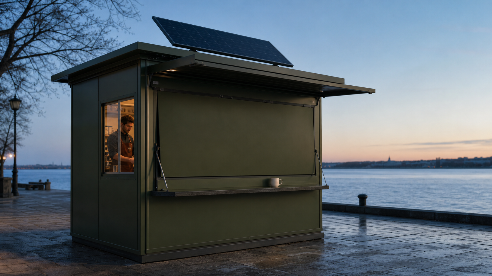
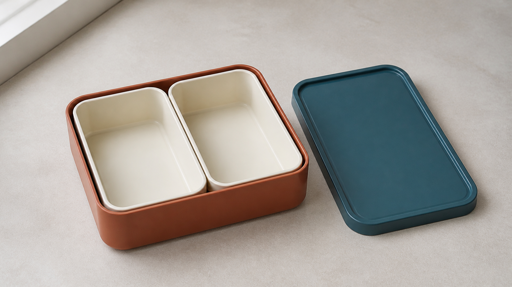
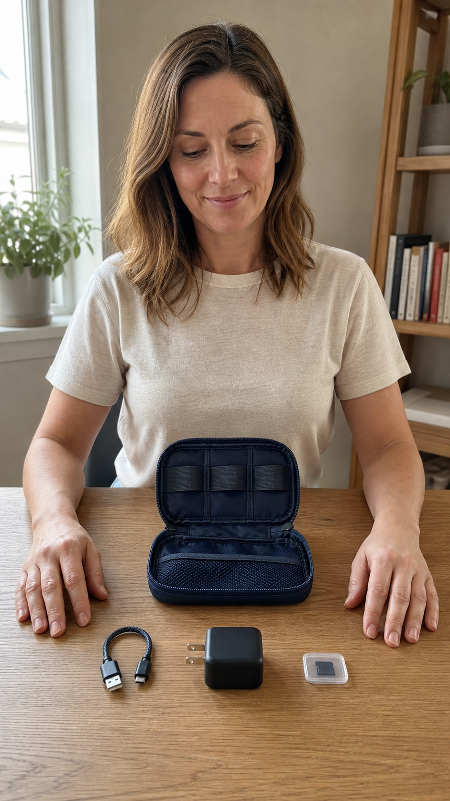
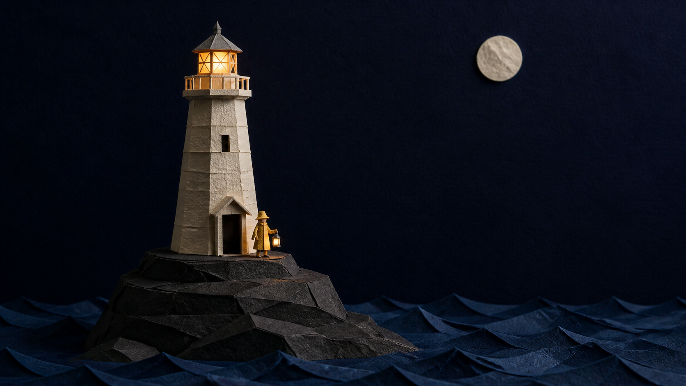
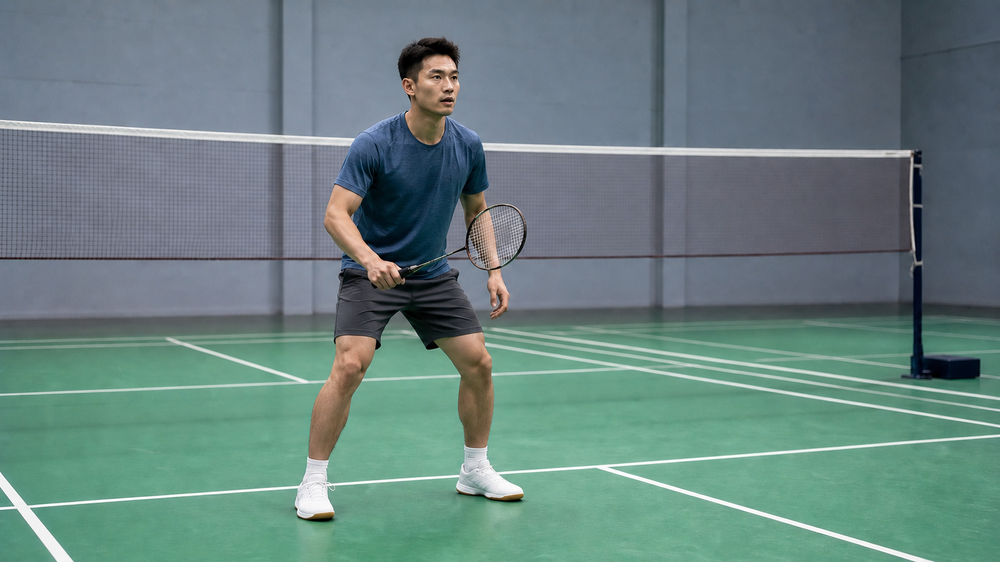
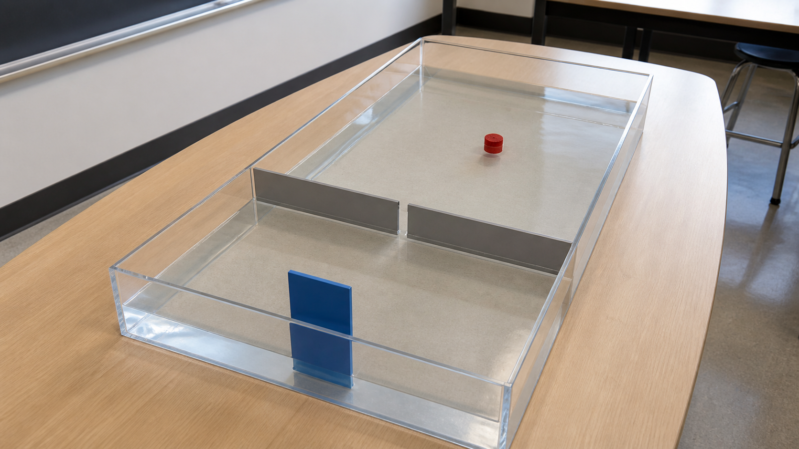
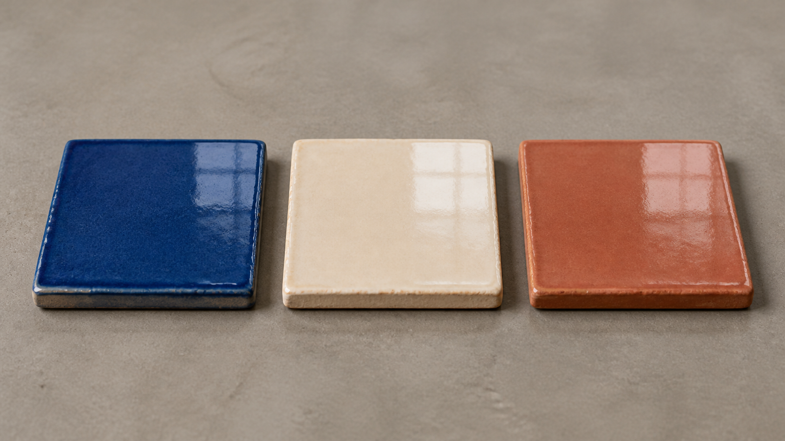
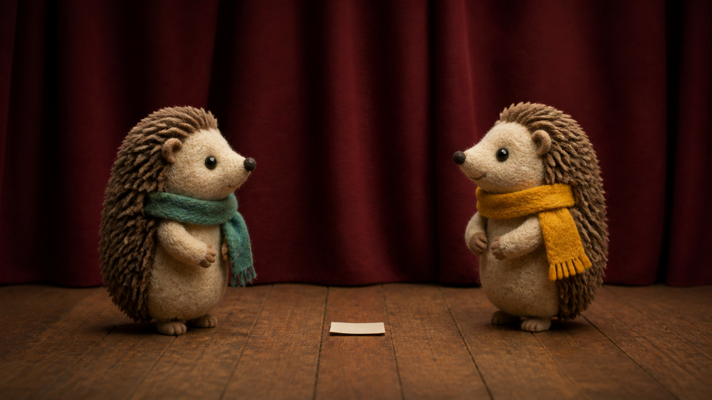

# Awesome MiniMax H3 비디오 프롬프트

> 광고, 제품 영상, UGC, 여행, 음식, 패션, 스토리텔링, 애니메이션, 스포츠, VFX, UI와 숏폼을 위한 실무형 MiniMax H3 프롬프트 모음입니다.

**언어:** [English](./README.md) · [简体中文](./README_zh.md) · [日本語](./README_ja.md) · [한국어](./README_ko.md) · [Español](./README_es.md) · [Français](./README_fr.md) · [Deutsch](./README_de.md) · [Português](./README_pt.md)

## 포함 내용

- 21개 카테고리의 영어 비디오 프롬프트 100개
- 이미지, 영상, 오디오 레퍼런스의 역할을 분리하는 H3 지향 구조
- 인물, 제품, 의상, 장소와 화면 방향을 유지하는 연속성 규칙
- 광고, 이커머스, UI, 애니메이션과 숏폼 제작 템플릿
- 8개 언어의 README와 영어 이외의 8개 언어로 제공되는 [프롬프트 예시](./docs/multilingual-prompting.md). 프롬프트 100개 전체를 각 언어로 번역한 것은 아닙니다
- [배포 가이드](./docs/deployment-guide.md)는 중국어 간체 상세 설명, 영어 참고 문서, 그 외 7개 언어의 요약으로 구성됩니다
- 새로 생성한 표지 1장과 참고 이미지 8장. 모두 정지 이미지 콘셉트이며 H3 생성 결과가 아닙니다

→ **[100개 프롬프트 살펴보기](./prompts/README.md)**

[H3 개요](./docs/minimax-h3-overview.md) · [배포 가이드](./docs/deployment-guide.md) · [API 워크플로](./docs/api-workflow.md) · [공식 영상 예시](./docs/official-h3-examples.md) · [템플릿](./templates/README.md) · [프롬프팅 가이드](./docs/prompting-guide.md) · [사용 사례 표](./docs/use-case-matrix.md) · [기여 가이드](./CONTRIBUTING.md)

## bestimage.ai API 워크플로

- **영상 생성:** [MiniMax H3 영어 페이지](https://bestimage.ai/models/minimax/minimax-h3-text-to-video/)에서 영상 프롬프트와 사용할 입력 방식을 확인하세요.
- **첫 프레임 및 참고 이미지 준비:** [GPT Image 2 영어 페이지](https://bestimage.ai/models/openai/gpt-image-2/)를 확인하세요. GPT Image 2는 이미지 모델이며 MiniMax H3와는 별개의 모델입니다.
- 연결 절차와 확인할 사항은 [API 워크플로](./docs/api-workflow.md)에 정리되어 있습니다.

참고 이미지는 내장 이미지 생성 도구로 만든 정적인 콘셉트 이미지입니다. H3 영상 출력물이 아니며 동작, 시간적 연속성, 오디오 품질을 보여 주는 자료가 아닙니다.

## 참고 이미지 갤러리

각 이미지는 첫 프레임이나 구도를 구상하기 위한 콘셉트입니다. 움직임, 시간적 연속성 또는 음향을 검증한 영상이 아닙니다.

| 콘셉트 | 정지 참고 이미지 | 해당 영어 프롬프트 |
|---|---|---|
| 태양광 커피 키오스크 개점 |  | [BRD-004](./prompts/01-brand-advertising.md#brd-004-solar-coffee-kiosk-opening) |
| 내부 용기 2개가 나란히 놓인 도시락에 음식 담기 |  | [PRD-004](./prompts/02-product-ecommerce.md#prd-004-two-tray-lunchbox-packing) |
| 여행용 케이블 파우치 정리 |  | [UGC-004](./prompts/03-ugc-lifestyle.md#ugc-004-cable-pouch-packing-demo) |
| 종이 등대의 불빛 |  | [ANI-004](./prompts/08-animation-stylized.md#ani-004-paper-lighthouse-beacon) |
| 배드민턴 스플릿 스텝 훈련 |  | [ACT-004](./prompts/09-action-sports.md#act-004-badminton-split-step-drill) |
| 파동 수조의 좁은 틈을 통과하는 파동 |  | [EDU-005](./prompts/14-education-documentary-science.md#edu-005-wave-tank-through-a-narrow-gap) |
| 세라믹 타일 카메라 움직임 연구 |  | [MRF-005](./prompts/20-multireference-camera-transfer.md#mrf-005-ceramic-tile-camera-study) |
| 고슴도치의 무대 리허설 |  | [CHR-005](./prompts/21-character-dialogue-performance.md#chr-005-hedgehog-stage-rehearsal) |

[이미지 제작 기록](./assets/README.md) · [첫 프레임 및 참고 이미지 제작 지침](./assets/minimax-h3-reference-image-prompts.md)

## 기여 및 출처

**기여를 환영합니다:** 실제 제작 문제를 해결한 오리지널 H3 프롬프트를 제안하려면 [기여 가이드](./CONTRIBUTING.md)를 읽어 주세요. 완성 영상은 필수가 아니지만 레퍼런스 역할, 타임라인, 연속성, 사운드와 테스트 상태를 명시해야 합니다.

이 저장소는 독립적인 커뮤니티 프로젝트이며 MiniMax의 공식 프로젝트가 아닙니다. 모델 사양과 입력 조건은 [MiniMax 공식 H3 문서](https://platform.minimaxi.com/docs/guides/video-prompt)를 확인하세요. [공식 영상 예시](./docs/official-h3-examples.md)는 MiniMax 출처를 밝힌 외부 참조이며, 이 저장소의 프롬프트로 생성한 결과가 아닙니다.

## bestimage.ai 소개

이 프롬프트 모음은 [bestimage.ai](https://bestimage.ai/) 팀이 편집하고 관리하며, 실용적인 제작 워크플로를 이미지·영상 모델 API와 연결합니다.

## bestimage.ai 제휴 프로그램으로 수익 얻기

튜토리얼, 프롬프트 또는 API 연동 사례를 공유하시나요? [bestimage.ai 제휴 프로그램](https://bestimage.ai/affiliate-program/)에 참여하여 독자와 시청자에게 bestimage.ai를 소개하고 커미션을 받으세요.

- 추천받은 사용자의 첫 번째 적격 유료 주문에 대해 **20%**.
- 해당 사용자 **등록 후 60일 이내**의 후속 적격 유료 주문에 대해 **10%**.

주문 자격과 정산에는 [현행 제휴 계약](https://bestimage.ai/affiliate-agreement/)이 적용됩니다.

## 라이선스

[MIT](LICENSE).
